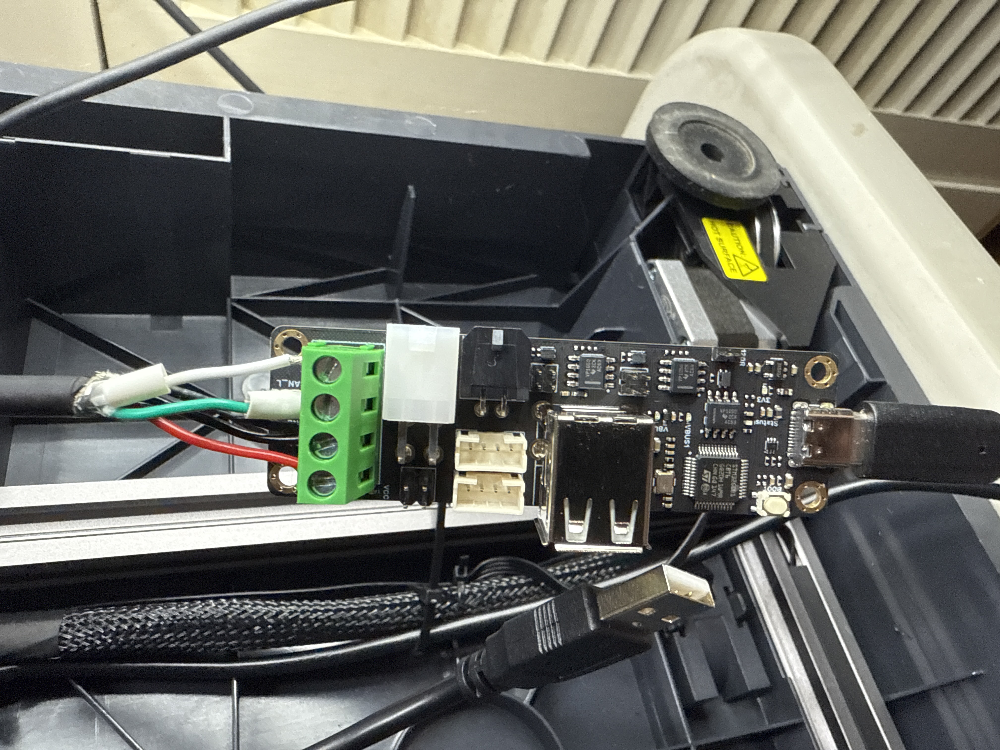

# Sovol SV08 to Sovol Zero Toolhead Upgrade via CAN (with BTT U2C)

## Overview
This guide walks you through replacing the stock Sovol SV08 toolhead with the Sovol Zero toolhead and wiring it to a BTT U2C CAN interface board.  
It covers hardware prerequisites, wiring, firmware flashing, and notes on macro compatibility.

This process allows you to benefit from high-flow extrusion and I2C sensor support over CAN, but requires mainline Klipper and some careful configuration.

---

## Prerequisites

### Hardware
- Sovol SV08 printer
- Sovol Zero toolhead (with integrated Eddy sensor and extruder)
- BTT U2C board (or equivalent USB-to-CAN adapter)
- Stock SV08 toolhead cable
- Small screwdriver, wire cutters, wire strippers
- Crimp ferrules or tinned wires
- USB-A to USB-C cable

---

## Wiring

### 1. Reuse the SV08 Stock Toolhead Cable
- Clip off or unpin the connector ends that plug into the MAINBOARD of the stock SV08 toolhead harness.  
  *Note:* One user has reported they had better luck flipping the toolhead cable around because of the shield drain.
- If you use a different CAN (FYSTEC UCAN) board and it doesn't have 24V on it, then provide 24V directly to the toolhead.
- Strip the wires and crimp/tin the ends or replace the connectors.



Here’s how the wiring should look when connected to the toolhead.

| Function   | U2C Terminal Block | Wire Color (Stock Toolhead) |
|------------|--------------------|-----------------------------|
| CAN High   | CANH               | Green                       |
| CAN Low    | CANL               | White                       |
| Ground     | GND                | Black                       |
| 24V        | 24V                | Red                         |

Video reference: [Nadir's method](https://www.youtube.com/shorts/DIurppqtce8)

- Connect the wires to the green screw terminal block on the BTT U2C board.  
  **Important:** Ground from the U2C should be wired directly to the toolhead ground, not to the chassis/frame. Ensure the 24V input to the U2C also shares a common ground path.
- Provide 24V power to the U2C board. You can use the original toolhead connector pins on the mainboard.
- Place the jumper on the 120R pins on the BTT U2C board (termination on both ends of the CAN chain).
- Connect the USB cable from the printer motherboard to the USB-C port on the U2C.

### 2. Mount the Toolhead
- The Sovol Zero toolhead mounts directly to the SV08 using the same three M3 screws from the stock toolhead.
- Ensure the toolhead fan spins when powered.

---

## Setup CAN Interface (Linux)

```bash
# Power on printer and SSH in
lsusb  # Confirm you see the CAN device (e.g. OpenMoko)

# Create CAN interface config
sudo nano /etc/network/interfaces.d/can0
```

Add these lines:
```
allow-hotplug can0
iface can0 can static
    bitrate 1000000
    up ip link set can0 txqueuelen 1024
```


Here’s how the wiring should look when connected to the toolhead.

*Note:* 500000 bitrate has been reported to work better in some setups.

```bash
sudo reboot
ifconfig can0  # Confirm CAN is up
```

---

## Building Klipper for Toolhead

1. **Confirm Toolhead is Wired Correctly**  
   You should see RX traffic on `ifconfig can0`, but the UUID may not show yet.

2. **Flash Klipper Using Katapult**  
   Stock Sovol Zero toolheads have Katapult pre-installed. Do not overwrite unless necessary.

Backup firmware: *(requires St-Link to flash)*

Build Klipper:
```bash
cd ~/klipper
make menuconfig  # Set for STM32F103, 8MHz crystal, CAN bus on PB8/PB9
make clean
make
```


Here’s how the make menuconfig should look

Flash Klipper:
```bash
sudo service klipper stop
python3 ~/katapult/scripts/flashtool.py -i can0 -q
python3 ~/katapult/scripts/flashtool.py -i can0 -f ~/klipper/out/klipper.bin -u <your_uuid>
sudo service klipper start
```

Get UUID:
```bash
python3 ~/katapult/scripts/flashtool.py -i can0 -q
```
Use this UUID in your `printer.cfg`.


Here’s how the wiring should look when connected to the toolhead.

---

## Relevant Sovol-Zero Snippets

```ini
[lis2dw]
cs_pin: extruder_mcu:PB12
spi_software_sclk_pin: extruder_mcu:PB13
spi_software_mosi_pin: extruder_mcu:PB15
spi_software_miso_pin: extruder_mcu:PB14
axes_map: x,z,y

[resonance_tester]
accel_chip: lis2dw
probe_points:
    175, 175, 30
accel_per_hz: 100
min_freq: 1
max_freq: 100
max_smoothing: 0.2
hz_per_sec: 0.5

[temperature_sensor Toolhead_Temp]
sensor_type: temperature_mcu
sensor_mcu: extruder_mcu

[probe_eddy_current btt_eddy]
sensor_type: ldc1612
#z_offset: 3.5
i2c_mcu: extruder_mcu
i2c_software_scl_pin: PB10
i2c_software_sda_pin: PB11
x_offset: -19.8
y_offset: -0.75

gcode_macro PROBE_EDDY_CURRENT_CALIBRATE_AUTO:
  gcode:
    BED_MESH_CLEAR
    G28 X Y
    G90
    G1 X{ printer.toolhead.axis_maximum.x/2 } Y{ printer.toolhead.axis_maximum.y/2 } F6000
    
      SET_KINEMATIC_POSITION Z={ printer.toolhead.axis_maximum.z-1 }
    
    PROBE_EDDY_CURRENT_CALIBRATE {rawparams}

[adc_temperature my_thermistor_e]
temperature1:25
resistance1:1268.60
temperature2:180
resistance2:1920.98
temperature3:300
resistance3:2398.52

[extruder]
step_pin: extruder_mcu:PA8
dir_pin: extruder_mcu:PA9
enable_pin: !extruder_mcu:PA11
rotation_distance: 6.5
microsteps: 16
full_steps_per_rotation: 200
nozzle_diameter: 0.400
filament_diameter: 1.75
max_extrude_only_distance: 150
max_extrude_cross_section: 60
heater_pin: extruder_mcu:PB7
sensor_type: my_thermistor_e
pullup_resistor: 11500
sensor_pin: extruder_mcu:PA5
min_temp: 0
max_temp: 355
max_power: 1.0
min_extrude_temp: 150
pressure_advance: 0.025
pressure_advance_smooth_time: 0.025

[tmc2209 extruder]
uart_pin: extruder_mcu:PA12
interpolate: True
run_current: 0.8
uart_address: 3
sense_resistor: 0.150

[verify_heater extruder]
max_error: 120
check_gain_time: 30
hysteresis: 5
heating_gain: 2

[fan]
pin: extruder_mcu:PB0
max_power: 1.0
cycle_time: 0.015
```

---

## Final Steps
- Zip-tie your wiring, tuck in the U2C board, and reinstall the bottom panel.
- Calibrate your Eddy Z offset and run `QUAD_GANTRY_LEVEL`.
- Re-tune filament flow rates if using the high-flow extruder.

---

## Summary
This is a great upgrade path for experienced users looking to get into CAN, I2C, and more modular Klipper setups using the Sovol Zero hardware. Just make sure you’re on mainline Klipper and take your time wiring and configuring firmware offsets.

**Happy printing!**

---

## Resources
- [CANBus Esoterical](https://canbus.esoterical.online/)
- [BTT Eddy Calibration](https://bttwiki.com/Eddy.html#calibration)
- Thanks to the help from @More Hp in the Sovol SV08 Group

